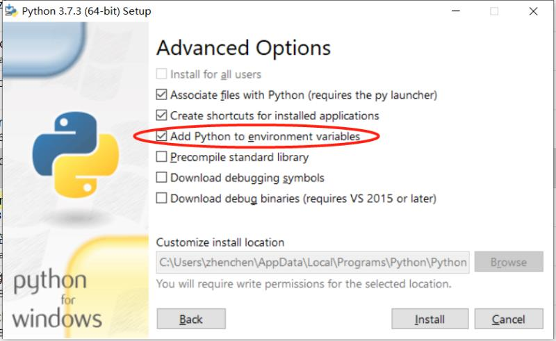

# Python环境安装

使用python-64位3.7.5，勾选环境变量。



## Jupyter


```pip install jupyter notebook```

### 安装Anaconda

Anaconda配置Jupyter

到[Anaconda](https://www.anaconda.com/distribution/)下载Anaconda针对Win的Python3.7发行版，按照正常步骤安装

**注意**：安装到英文目录， **不要** 勾选把Anaconda加入系统path

### 添加清华镜像源

**注意** 今后对Anaconda环境的命令都需要在Anaconda Prompt（之后简称终端）中 **以管理员身份** 执行，避免污染python环境！

在终端中执行以下命令，在conda安装包路径中添加清华镜像，可以大大提升各类包的安装速度

```
conda config --add channels https://mirrors.tuna.tsinghua.edu.cn/anaconda/pkgs/free/
conda config --add channels https://mirrors.tuna.tsinghua.edu.cn/anaconda/pkgs/main/
conda config --add channels https://mirrors.tuna.tsinghua.edu.cn/anaconda/cloud/conda-forge/
conda config --add channels https://mirrors.tuna.tsinghua.edu.cn/anaconda/cloud/msys2/
conda config --add channels https://mirrors.tuna.tsinghua.edu.cn/anaconda/cloud/bioconda/
conda config --add channels https://mirrors.tuna.tsinghua.edu.cn/anaconda/cloud/menpo/
conda config --add channels https://mirrors.tuna.tsinghua.edu.cn/anaconda/cloud/pytorch/
conda config --add channels https://mirrors.tuna.tsinghua.edu.cn/anaconda/cloud/peterjc123/
conda config --set show_channel_urls yes
```

使用`conda info`可以看到已有的channels

### 更新所有库

1. 在终端中执行`conda upgrade pip`，更新`pip`

2. 在终端中执行`conda update --all`，更新所有库

3. 在终端中执行`conda install -c conda-forge jupyter_contrib_nbextensions`，安装jupyter_nbextensions

   *（如果下载太慢也可以开VPN用`pip install jupyter_contrib_nbextensions`）*

### 启用jupyter nbextensions

1. 在终端中执行`jupyter nbextensions_configurator enable --system`，使nbextensions生效

2. 然后执行`jupyter contrib nbextension install --system`

3. 然后执行`jupyter contrib nbextension install --sys-prefix`

### 修改Jupyter默认目录和浏览器

1. 首先找到Jupyter的快捷方式，右键-属性-目标中删除“%Userprofile%
2. 打开终端，输入`jupyter notebook --generate-config`，在对应的文件夹中找到jupyter_notebook_config.py
3. 文本打开jupyter_notebook_config.py，查询找到"c.NotebookApp.notebook_dir ="这个字符串，将它前面的“#”号去掉，等号后面赋值默认工作目录，保存退出；
4. 注意 **规避字符常量，比如\0是空字符常量，如果文件夹名称形如“01_APP”，则\要改为\\**
5. Jupyter使用系统默认浏览器，所以打开win10默认应用，修改默认浏览器即可

### 安装和启用nbextensions扩展

1. 使用`conda install autopep8`或开VPN使用`pip install autopep8`安装`autopep8`

2. 打开jupyter，在`edit`-`nbextensions config`中启用（个人习惯）`(some) LaTeX environments for Jupyter`,`Collapsible Headings`,`contrib_nbextensions_help_item`,`Equation Auto Numbering`,`Hide input`,`Nbextensions edit menu item`,`Python Markdown`,`Table of Contents (2)`,`Variable Inspector`,`2to3 Converter`,`Autopep8`,`Codefolding`,`Gist-it`,`jupyter-js-widgets/extension`,`Live Markdown Preview`,`Move selected cells`,`Nbextensions dashboard tab`,`Split Cells Notebook`

### Anaconda清理

`conda clean --all`删除所有安装包文件
